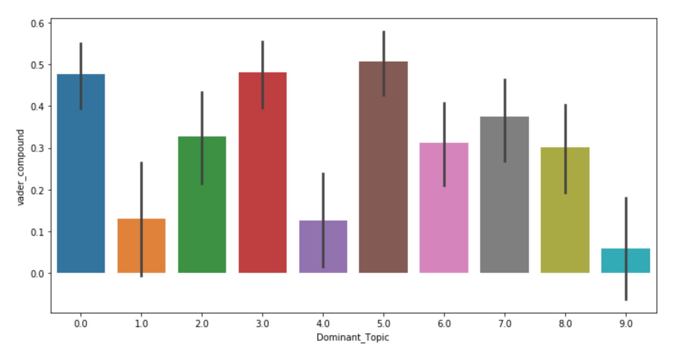
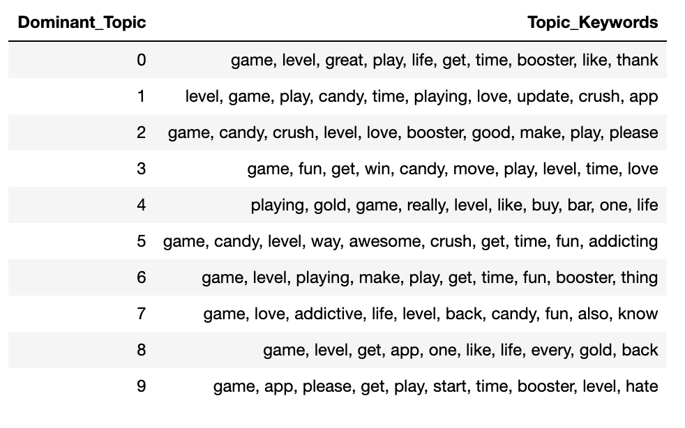

# CS 410 Text Information Systems Final Project

* Teammate:
    - 1. Jong Park  
    NetID: jonghp2   
    
    - 2. Han-Tse Chiou  
    NetID: htchiou2  
    
    - 3. Mohammed Zayeem Allahbaksh  
    NetID: mza3
    
# rvwanalyzr
Rvwanalyzr analyzes appstore product reviews to provide insights regarding the review sentiments and the topic keywords related. The result is useful for figuring out the key features or topics that are correlated to the users sentiments. 

* The tool builds out 3 differnt models with the review data.

    * [VADER](https://www.nltk.org/_modules/nltk/sentiment/vader.html) - Valence based sentiment analysis from nltk. VADER's sentiment score in fine grained scale and the ability to evaluate social media expression are powerful features for the tool.
    * [Naive Bayes classifier](https://www.nltk.org/_modules/nltk/classify/naivebayes.html) - this classic model's output is **not used** directly but kept for the future usage.
    * [LDA](https://radimrehurek.com/gensim/models/ldamodel.html) topic modeler - The resulting top ranked topics are correlated with the sentiment.

## Components


## Downloading data to analyze
* app-store-scripts/fetch-reviews.js downloads reviews under each data/apps/<app id> folder. There will be 10 files which is the max number of pages that app store API allows.

* To collect app store reviews
  Add a folder named matching the app id under app-store-scripts/data/apps folder and run
 
  ```
  $ cd app-store-scripts
  $ npm install app-store-scraper
  $ node fetch-reviews.js
  ```
 

## Building the models
Model builder runs review data through VADER sentiment analyzer, Naive Bayes classifier and LDA topic modeler. It creates csv files containing the results for each in the output folder of the working directory.
* Add Module Dependencies via pip
    ```
    pip install --upgrade gensim seaborn nltk
    ```
* To build model with the data downloaded by fetch-reviews.js at the default location, app-store-scripts/data/apps/
  ```
  $ python review_analyzer/sent_model_builder.py
  ```
* To build model with the data stored at specific folder
  ```
  $ python review_analyzer/sent_model_builder.py <path to the folder containing folders named [app id]>
  ```

## Model output analysis 
Model output is analyzed to discover a particular set of topic keywords related to a sentiment. Sentiment score of all reviews with the same dominant topic is collected to produce the average sentiment. The resulting average sentiment score and the dominant topics are plotted to show the degree of topic's sentiment. The implementation uses Jupyter Notebook. VADER's compound sentiment score and top 10 dominant topics are used to plot the graph such as the following.

<p align="center">
  
</p>


<p align="center">
  
</p>

* To load and run the script in Jupyter Notebook
  ```
  $ cd review_analyzer
  $ jupyter notebook
  ```
  When the Jupyter Notebook tab on the browser shows up, select 'rvwanalyzr.ipynb'.

## Future items

* Removal of common sentimental keywords from the topic model after the topic is correlated to the sentiment. This filters out the obvious keywords and leaves only a discerning word such as the name of a new product feature.

* Time Series based graph showing the sentiment trend per product version or patch updates. This is useful for the marketing and future strategy of the app.


## Run the presentation locally

* Install and use the Node 10 library
    ```
    $ nvm install node10
    $ nvm use 10
    ```
* Install the library
    ```
    $ npm i -g @amazingandyyy/markdeck
    ```
* The presentation.md markdown is under `decks/` folder.

* Present it!!

    ```
    $ deck --assets images
    ...
    # alive on http://localhost:1234/deck/presentation/
    ```

## Built With

* [app-store-scraper](https://github.com/facundoolano/app-store-scraper) - NPM Module used to download the Appstore reviewss
* [NLTK](http://www.nltk.org/) - Model Builder
* [gensim](https://radimrehurek.com/gensim/) - LDA Topic Modelling
* [seaborn](https://seaborn.pydata.org/) - Data Visualization
